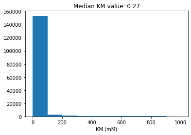
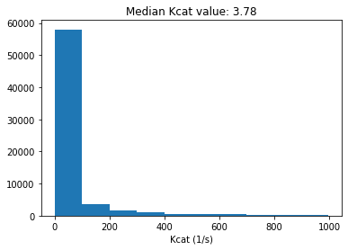
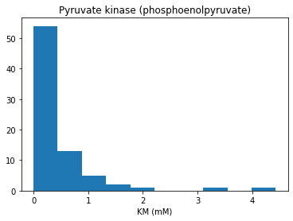
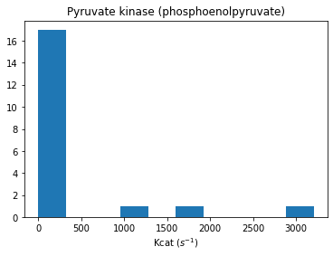

# A python parser for the BRENDA database

This project provides python classes and functions to parse the text file containing the entire BRENDA enzyme database (https://www.brenda-enzymes.org)

This is an ongoing project!


```python
import numpy as np
from matplotlib import pyplot as plt
from parseBRENDA import BRENDA
workDir = 'C:/Users/tinta/OneDrive/Documents/Projects/BRENDA'
dataFile = workDir + '/brenda_download.txt'
```

## 1. Parsing BRENDA


```python
# Let's load the database
brenda = BRENDA(dataFile)
brenda
```


<table>
    <tr>
        <td><strong>Number of Enzymes</strong></td><td>7558</td>
    </tr><tr>
        <td><strong>BRENDA copyright</strong></td><td>Copyrighted by Dietmar Schomburg, Techn. University
Braunschweig, GERMANY. Distributed under the License as stated
at http:/www.brenda-enzymes.org</td>
    </tr><tr>
        <td><strong>Parser version</strong></td><td>0.0.1</td>
    </tr><tr>
        <td><strong>Author</strong></td><td>Semidán Robaina Estévez, 2020</td>
    </tr>
</table>


```python
# Plot all Km values in the database
BRENDA_KMs = np.array([v for r in brenda.reactions
                       for v in r.KMvalues.get_values()])
values = BRENDA_KMs[(BRENDA_KMs < 1000) & (BRENDA_KMs >= 0)]
plt.hist(values)
plt.title(f'Median KM value: {np.median(values)}')
plt.xlabel('KM (mM)')
plt.show()
print(f'Minimum and maximum values in database: {values.min()} mM, {values.max()} mM')
```





    Minimum and maximum values in database: 0.0 mM, 999.8 mM


```python
# Plot all Km values in the database
BRENDA_Kcats = np.array([v for r in brenda.reactions
                       for v in r.Kcatvalues.get_values()])
values = BRENDA_Kcats[(BRENDA_Kcats < 1000) & (BRENDA_Kcats >= 0)]
plt.hist(values)
plt.title(f'Median Kcat value: {np.median(values)}')
plt.xlabel('Kcat (1/s)')
plt.show()
print(f'Minimum and maximum values in database: {values.min()} 1/s, {values.max()} 1/s')
```





    Minimum and maximum values in database: 5.83e-10 1/s, 997.0 1/s


```python
# Plot all enzyme optimal temperature values in the database
BRENDA_TO = np.array([v for r in brenda.reactions
                       for v in r.temperature.filter_by_condition(
                           'optimum').get_values()])
values = BRENDA_TO[(BRENDA_TO >= 0)]
plt.hist(values)
plt.title(f'Median Optimum Temperature: {np.median(values)}')
plt.xlabel('TO (${}^oC$)')
plt.show()
print(f'Minimum and maximum values in database: {values.min()} °C, {values.max()} °C')
```


    Minimum and maximum values in database: 0.0 °C, 125.0 °C


## 2. Extracting data for _Pyruvate kinase_


```python
# We can retrieve an enzyme entry by its EC number like this
r = brenda.reactions.get_by_id('2.7.1.40')
r
```


<table>
    <tr>
        <td><strong>Enzyme identifier</strong></td><td>2.7.1.40</td>
    </tr><tr>
        <td><strong>Name</strong></td><td>Pyruvate kinase</td>
    </tr><tr>
        <td><strong>Systematic name</strong></td><td>ATP:pyruvate 2-O-phosphotransferase</td>
    </tr><tr>
        <td><strong>Reaction type</strong></td><td>Phospho group transfer</td>
    </tr><tr>
        <td><strong>Reaction</strong></td><td>ATP + pyruvate <=> ADP + phosphoenolpyruvate</td>
    </tr>
</table>


```python
# Here are all the KM values for phosphoenolpyruvate associated with this enzyme class
compound = 'phosphoenolpyruvate'
kms = r.KMvalues.filter_by_compound(compound).get_values()
plt.hist(kms)
plt.xlabel('KM (mM)')
plt.title(f'{r.name} ({compound})')
plt.show()
```


```python
# Here are all the KM values for phosphoenolpyruvate associated with this enzyme class
compound = 'phosphoenolpyruvate'
kms = r.KMvalues.filter_by_compound(compound).get_values()
plt.hist(kms)
plt.xlabel('KM (mM)')
plt.title(f'{r.name} ({compound})')
plt.show()
```





```python
# And further filtered by organism
r.KMvalues.filter_by_organism('Bos taurus').filter_by_compound('phosphoenolpyruvate').get_values()
```


    [0.051500000000000004, 0.18]


```python
# Here are all the Kcat values for phosphoenolpyruvate associated with this enzyme class
compound = 'phosphoenolpyruvate'
kcats = r.Kcatvalues.filter_by_compound(compound).get_values()
plt.hist(kcats)
plt.xlabel('Kcat ($s^{-1}$)')
plt.title(f'{r.name} ({compound})')
plt.show()
```



